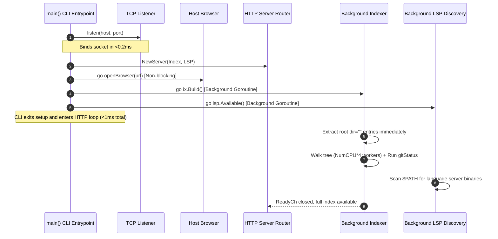

# System Architecture & Runtime Lifecycle

This document describes the high-level architecture, startup pipeline, HTTP server, memory scavenging, and security model of `px1`.

## 1. High-Level Design Principles

px1 is building review reports linked from GitHub PRs, with diffs, concise AI
explanations beside highlighted code, and team-rule findings. See the
[product vision](../PRODUCT_VISION.md) for status. This document describes the
existing local application that supports that work:

1. Edits Are Delegated: px1 navigates, searches, and inspects code, and does not author changes itself. There are no save buttons and no endpoint accepts file content. Optional provider actions are explicitly requested from review surfaces, while ordinary harness work remains external to px1 (see [Review Provider Dispatch](agent-editing.md)).
1. Single Static Binary Footprint: All frontend assets (HTML, CSS, JavaScript, and icons) are embedded directly into the Go binary at compile time via `go:embed`. px1 requires no Node.js, Python, or Ruby runtime, no external database, and no CGO dependencies.
1. Sub-Millisecond Responsiveness: The HTTP listener binds, serves the web UI, and opens the default browser in under 1 millisecond. Heavy operations (full directory indexing, git status checks, language server binary discovery) run asynchronously off the critical path.
1. Stateless in the Workspace: px1 never writes runtime configuration directories, temporary caches, or metadata files into a workspace. Indexes and caches live in volatile memory. Outside the workspace it keeps user settings, review baselines, and update state under `~/.px1/` (or `$XDG_CONFIG_HOME/px1/`); repository-owned team policy is the deliberate exception at `.px1/rules.json`.
1. Strict Memory Reclamation: Long-lived background processes should not hold idle RAM. When the user finishes a burst of queries, unused pages are proactively returned to the operating system.

## 2. Startup Pipeline (<1 ms Critical Path)

When `px1` is executed in a terminal (e.g., `px1 .` or `px1 main.go:42`), the initialization flow executes as follows. A file target detects its enclosing project repository (or working directory) as the workspace and is passed to the browser with its relative path and optional line number.



### Key Stages in [`main.go`](../../main.go)

1. Target Resolution: Directories become workspace roots. For a file target, its repository or project root is detected as the workspace, and its relative path (with optional line number) is retained for the initial browser tab.
1. Socket Binding: `listen(*host, *port)` binds an ephemeral or user-specified TCP socket immediately.
1. Instant Root Tree Extraction: Before descending into subdirectories, `ix.Build()` extracts and populates the root directory entries (`dir=""`), publishing them directly to `ix.children[""]`. When the browser makes its initial request to `/api/tree`, it immediately renders the root tree nodes without waiting for the deep repository scan to finish.
1. Non-Blocking Browser Launch: `go openBrowser(url)` spawns the platform-specific browser opener (`xdg-open` on Linux, `open` on macOS, `rundll32` on Windows) in a separate goroutine.
1. Concurrent Tree Walk & Git Status: Indexing runs inside a background goroutine. A dedicated goroutine runs `gitStatus(ix.root)` in parallel with the file walk so that subprocess overhead overlaps the walk rather than adding to it.
1. Background Language Server Discovery: `lsp.Available()` checks `$PATH` using `exec.LookPath` across standard binary locations asynchronously.

## 3. HTTP Server & API Catalog

The server is implemented in [`server.go`](../../server.go) using Go's standard `http.ServeMux`. Every request passes through a centralized `ServeHTTP` wrapper that records activity timestamps and applies pooled Gzip compression when accepted by the client.

### Endpoints Reference

| Endpoint              | Method | Purpose                                                                 | Response Format                            |
| --------------------- | ------ | ----------------------------------------------------------------------- | ------------------------------------------ |
| `/`                   | `GET`  | Serves `web/index.html` (embedded or `-dev` disk copy)                  | `text/html; charset=utf-8`                 |
| `/github/:owner/:repo/pull/:number?sha=:head` | `GET` | Serves an imported immutable report when present; otherwise serves the app with the validated identity embedded as read-only JSON | `text/html; charset=utf-8` |
| `/static/*`           | `GET`  | Serves bundled JavaScript, CSS, and static assets                       | Asset MIME type                            |
| `/api/meta`           | `GET`  | Workspace metadata (root path, file count, git status)                  | JSON (`{root, name, files, git}`)          |
| `/api/tree`           | `GET`  | Directory contents for the sidebar file explorer (`?dir=path`)          | JSON array of `Node` objects               |
| `/api/file`           | `GET`  | Windowed, highlighted source file lines (`?path=...&start=0&count=500`) | JSON (`{lines, total, refine}`)  |
| `/api/raw`            | `GET`  | Raw, unhighlighted file content for whole-file copies                  | `text/plain` or binary                     |
| `/api/find`           | `GET`  | Fast fuzzy match against all indexed workspace paths (`?q=...`)         | JSON array of `FuzzyResult` objects        |
| `/api/search`         | `GET`  | Full-text project grep with snippet elision (`?q=...&case=...&regex=...`)| JSON array of file hits and matches        |
| `/api/outline`        | `GET`  | Regex-extracted symbol outline for a given file (`?path=...`)          | JSON array of symbol declarations          |
| `/api/def`            | `GET`  | Quick definition lookup fallback                                        | JSON array of matching definition locations|
| `/api/diff`           | `GET`  | Unified diff of working tree vs. `HEAD` (`?path=...`)                   | JSON (`{path, diff, available}`)           |
| `/api/gutter`         | `GET`  | Per-line change markers for code view gutter                            | JSON (`{added, modified, deleted}`)        |
| `/api/reindex`        | `POST` | Re-runs index walk and git status on demand (triggers frontend tab reload; see [`file-reload-and-updates.md`](file-reload-and-updates.md)) | JSON (`{ok}`)                              |
| `/api/lsp/def`        | `GET`  | Go-to-Definition via LSP (`?path=...&line=...&col=...`)                 | JSON array of target locations             |
| `/api/lsp/refs`       | `GET`  | Find References via LSP                                                 | JSON array of reference locations          |
| `/api/lsp/calls`      | `POST` | Incoming/outgoing call hierarchy tree expansion                         | JSON array of `CallNode` objects           |
| `/api/lsp/symbols`    | `GET`  | Document symbols extracted via LSP                                      | JSON array of LSP symbols                  |
| `/api/lsp/hover`      | `GET`  | Type signature and markdown doc hovercard info                          | JSON (`{contents: ...}`)                   |
| `/api/lsp/warm`       | `POST` | Pre-warms or spawns language server for given file extension            | JSON (`{ok: true}`)                        |
| `/api/lsp/setup`      | `GET`  | Reports install status and commands for current file language           | JSON (`{installed, recipes, ...}`)         |
| `/api/lsp/install`    | `POST` | Executes user-level installer in background                             | JSON (`{ok: true}`)                        |
| `/api/lsp/start`      | `POST` | Rescans and starts language server after installation                   | JSON (`{ok: true}`)                        |
| `/api/agent/job`      | `GET`  | Snapshot of an explicit review-provider job `?id=...`, or the most recently started when omitted | JSON job snapshot |
| `/api/review/import`  | `POST` | Authenticated, size-limited import of a versioned GitHub PR snapshot; requires `PX1_IMPORT_TOKEN` | JSON (`{imported, path, target}`) |
| `/api/audit`          | `GET`  | Session log of allowed and refused patch, agent, and check decisions    | JSON (`{entries}`)                 |
| `/api/review/attention` | `GET` | Runs bounded, deterministic high-review-risk heuristics against the active task baseline | JSON (`{flags, truncated}`) |
| `/api/review/attention/dismiss` | `POST` | Dismisses one current attention flag for the active review session | JSON (`{flags, truncated}`) |

Attention analysis reads at most 500 changed files, 512 KiB per file, and 8
MiB of text in total, and returns at most 250 flags. It uses no model or remote
API. Flag IDs derive from the rule, path, and evidence so dismissals remain
stable inside the review session while changed evidence can be flagged again.

### Automatic external-change refresh

px1 captures a review baseline for the current workspace during startup. The browser polls `GET /api/review/revision` every two seconds; when the compact fingerprint differs, it runs the normal re-index and in-place tab reload path. This makes ordinary harness writes visible without a wrapper command or a filesystem-watcher dependency in the server.

## 4. Memory Management & Proactive Scavenging

Even though Go's garbage collector frees unreferenced heap objects rapidly, the Go runtime does not immediately release physical memory pages back to the host operating system. In high-churn CLI sessions (such as searching a 50,000-file repository), the process resident set size (RSS) could appear inflated long after the search completes.

To maintain a lean footprint (~20 MB RSS), `server.go` implements an automatic scavenger:

```go
func (s *Server) scavenge() {
    const idleFor = 15 * time.Second
    tick := time.NewTicker(10 * time.Second)
    defer tick.Stop()
    done := true
    for range tick.C {
        idle := time.Since(time.Unix(0, s.lastReq.Load()))
        if idle < idleFor {
            done = false
            continue
        }
        if done {
            continue
        }
        debug.FreeOSMemory()
        done = true
    }
}
```

### Scavenging Mechanism

- `s.lastReq`: An atomic 64-bit integer tracks the Unix timestamp (in nanoseconds) of the most recent incoming HTTP request.
- When no HTTP traffic has arrived for 15 seconds after an active period, `debug.FreeOSMemory()` is invoked.
- Physical memory pages freed by the GC are surrendered back to the operating system kernel immediately, preventing background memory bloat.

### Gzip Buffer Pooling

To avoid heap allocations on every JSON endpoint response, `gzip.Writer` instances are pooled via `sync.Pool` using `gzip.BestSpeed`:

```go
var gzipPool = sync.Pool{New: func() any {
    w, _ := gzip.NewWriterLevel(io.Discard, gzip.BestSpeed)
    return w
}}
```

## 5. Security Model & Path Sandboxing

Because px1 exposes a local HTTP server that can display source files and interact with local tools, strict boundary constraints are enforced.

### Path Resolution (`safePath` & `resolvePath`)

Paths supplied by client queries are rigorously sanitized:

1. Leading slashes and spaces are trimmed.
1. The path is cleaned via `filepath.Clean()`.
1. Paths attempting directory traversal (`..`, `../`, or containing `..` path segments) are rejected with HTTP 400.
1. Any path that resolves outside the indexed workspace root is rejected, unless it has been explicitly admitted into the external path allowlist (`extAllowed`).

### External Path Allowlist (`extAllowed`)

When navigating code via LSP Go-to-Definition, targets often reside outside the workspace directory (e.g., standard library packages in `/usr/local/go/src` or cached crates in `~/.cargo/registry`).

- Rather than opening up arbitrary filesystem reads, targets returned by the trusted LSP server are admitted into an in-memory allowlist: `extAllowed[canonicalPath] = true`.
- `/api/file` and `/api/raw` permit reading external files only if the exact path exists in `extAllowed`.
- External paths can never be enumerated via `/api/tree` or searched via `/api/search`.

### Origin Verification and Remote Capabilities

Filesystem edits (`patch`, revert, restore), process execution (review-provider actions and language-server install/start), and verification-command attempts are three separate capabilities. Loopback (`localhost`, `127.0.0.1`, `::1`) may use all three. Any other IP, hostname, or reverse-proxy name is read-only unless that one capability is enabled with `-allow-patch`, `-allow-agent`, or `-allow-checks`. Enabling one does not enable the others. A remote capability also requires `Authorization: Bearer` matching `-remote-token` or `PX1_REMOTE_TOKEN`; a flag without a token stays refused.

Every such request must be a POST whose `Origin` matches `Host`. Other machine-changing routes, such as settings and review comments, still use `localPost`: POST, matching origin, and a host that is an IP or `localhost`. That blocks a website on another origin, including a DNS-rebinding hostname, from calling them. The bearer token is what makes an opted-in hostname safe to allow for one capability: the attacker's page does not have the token.

px1 does not execute verification commands. `POST /api/review/checks` passes the check capability gate and then returns that CI results are imported, not run. Successful and refused capability decisions are kept in an in-memory session log at `GET /api/audit` (loopback, or a remote request that presents the token). `/api/meta` includes the policy for the request host so the UI can show local access or remote read-only.

The executed command is never supplied by the client. Language-server installs come from `lspRegistry`. Review-provider actions use the configured provider; only the review prompt comes from the action.

Anyone who can open the server can read the workspace. SSH local forwarding to `127.0.0.1` is loopback, so that browser has local write access. A LAN IP or Tailscale hostname does not.

### Self-Update Integrity

Before `px1 --update` executes or installs a release binary, it verifies the download against the SHA-256 digest in that release's `checksums.txt` asset. Missing, malformed, or mismatched checksum data aborts the update without replacing the current executable.
